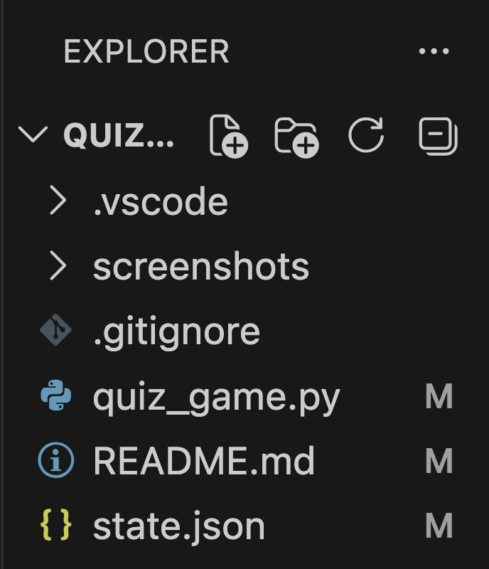

### 1. 프로젝트 개요
#### (1) 구현 환경
- OS: macOS 15.7.4
- Git: 2.53.0
- IDE: VSCode

#### (2) 과제를 시행함에 앞서, 아래 목표를 습득을 목표로 한다.
- Python 기초

    변수가 무엇이고, 왜 사용하는지 설명할 수 있다.
    int, str, bool, list, dict의 차이를 설명할 수 있다.
    if/elif/else로 조건에 따라 다른 동작을 수행할 수 있다.
    for와 while의 차이를 설명하고 적절히 선택할 수 있다.
    함수를 정의하고, 매개변수와 반환값을 활용할 수 있다.

- 클래스와 객체

    클래스가 무엇이고, 왜 사용하는지 설명할 수 있다.
    __init__ 메서드와 self의 역할을 설명할 수 있다.
    클래스의 속성(attribute)과 메서드(method)를 정의하고 활용할 수 있다.

- 파일 입출력

    파일을 열고, 읽고, 쓰는 기본 과정을 설명할 수 있다.
    JSON 형식이 무엇이고, 왜 데이터 저장에 사용하는지 설명할 수 있다.2
    try/except를 사용하여 오류를 처리할 수 있다.

- Git 기초

    Git이 무엇이고 왜 필요한지 설명할 수 있다.
    init, add, commit, push, pull, checkout, clone이 각각 무엇을 하는지 설명할 수 있다.
    브랜치를 생성하고 병합할 수 있다.
    원격 저장소를 clone하고, pull로 변경사항을 가져올 수 있다.

### 2. 퀴즈 주제 선정 이유
컴퓨터 전공생이다 보니 컴퓨터 하드웨어에 대한 관심이 많은 상태로 하드웨어와 같은 문제를 내면 재밌을 것 같다는 생각에 출제하게 되었다.

### 3. 실행 방법
터미널에서 프로젝트 디렉토리로 이동한 후, python quiz_game.py를 입력한 후 엔터를 눌러 프로그램을 실행함

### 4. 기능 목록
- 퀴즈 풀기
- 퀴즈 추가
- 퀴즈 목록 열람
- 최고 점수 확인

### 5. 파일 구조


### 6. 데이터 파일 설명
- state.json 경로: 프로젝트 루트 디렉토리
- 역할: 게임 실행에 필요한 정보(문제, 선택지, 정답, 최고 점수 등)를 총괄하여 프로그램 시작시 그에 따른 정보를 제공하는 역할을 수행
- 필드 구조 
    ```json
    {
        "quizzes": [
            {
                "question": "컴퓨터의 '두뇌' 역할을 하며 모든 연산과 제어를 담당하는 부품은 무엇인가요?",
                "choices": ["RAM", "CPU", "HDD", "GPU"],
                "answer": 2
            },
            {
                "question": "데이터를 일시적으로 저장하며, 전원이 꺼지면 내용이 사라지는 휘발성 메모리는?",
                "choices": ["SSD", "ROM", "RAM", "CPU"],
                "answer": 3
            },
            {
                "question": "그래픽 작업과 영상 출력을 전문적으로 처리하는 장치는?",
                "choices": ["GPU", "메인보드", "파워 서플라이", "사운드 카드"],
                "answer": 1
            },
            {
                "question": "반도체를 이용하여 데이터를 저장하며, HDD보다 속도가 훨씬 빠른 저장장치는?",
                "choices": ["CD-ROM", "SSD", "RAM", "USB 메모리"],
                "answer": 2
            },
            {
                "question": "모든 하드웨어 부품이 장착되어 서로 데이터를 주고받을 수 있게 연결해주는 판은?",
                "choices": ["케이스", "쿨러", "메인보드", "랜카드"],
                "answer": 3
            }
        ],
        "best_score":0
    }
    ```